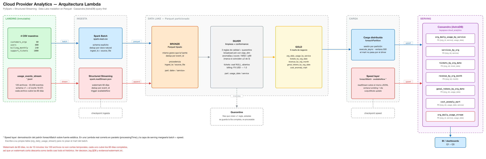

# Cloud Provider Analytics — Big Data 72.80 (ITBA, 1C 2026)

Pipeline analítico con **arquitectura Lambda** para un proveedor de nube: ingestar, limpiar, conformar y publicar datos para **FinOps**, **Soporte** y **Producto/GenAI**, usando **PySpark** + **Structured Streaming** en Colab, **Parquet** como almacenamiento intermedio y **Cassandra (AstraDB)** como capa de serving *query-first*.

**Integrantes:** Camila Lee (63382), Lucas Perri (62746)

[](https://colab.research.google.com/github/CamilaBelenLee/cloud_provider_analytics/blob/main/notebooks/cloud_provider_analytics_mvp.ipynb)

## Contenido

1. [Quickstart](#quickstart-pasos-exactos)
2. [Arquitectura del pipeline](#arquitectura-del-pipeline)
3. [Documentación de decisiones](#documentación-de-decisiones)
4. [Arquitectura](#arquitectura) — zonas del lake y carga distribuida
5. [Datos: notas del esquema real](#datos-notas-del-esquema-real)
6. [Calidad de datos](#calidad-de-datos)
7. [Detección de anomalías](#detección-de-anomalías)
8. [Serving: tablas CQL](#serving-tablas-cql-con-una-columna-colección)
9. [Estructura física del Data Lake](#estructura-física-del-data-lake-evidencia-de-particionado)
10. [Resultados de las consultas](#resultados-de-las-consultas)
11. [Evidencia](#evidencia-docsevidence)
12. [Alcance, supuestos y limitaciones](#alcance)

---

## Quickstart (pasos exactos)

1. Abrir el notebook en Colab con la insignia de arriba (o *Archivo → Abrir notebook → GitHub* y pegar la URL del repo).
2. **Datos:** correr la celda opcional *0b* (clona el repo y copia `datalake/landing/` a `/content/`), **o** subir el dataset a mano para tener `/content/datalake/landing/` con los 7 CSV y `usage_events_stream/*.jsonl`.
3. En AstraDB: crear una base **Serverless (Non-Vector)** y el keyspace **`cloud_analytics`**; generar un **application token** (`AstraCS:...`) y descargar el **Secure Connect Bundle** (zip). Subir el zip a `/content/`.
4. Cargar las credenciales **sin hardcodear**: copiar `.env.example` a `.env` y completarlo, **o** cargar `SCB_PATH`, `ASTRA_TOKEN`, `ASTRA_KEYSPACE` en **Colab Secrets**.
5. *Entorno de ejecución → Ejecutar todo.* El notebook corre `Landing → Bronze → Silver → Gold → Cassandra`, ejecuta las 5 consultas y muestra la prueba de idempotencia sobre las 6 tablas.

> Si el keyspace ya fue usado por una corrida anterior, la celda de **migración de esquema** agrega con `ALTER TABLE` las columnas nuevas de `tickets_by_org_date` y `revenue_by_org_month`. `CREATE TABLE IF NOT EXISTS` no modifica una tabla que ya existe, así que sin ese paso el INSERT falla con *Undefined column name*.

```
cloud_provider_analytics/
├── README.md
├── requirements.txt
├── .env.example                       # plantilla de credenciales (copiar a .env)
├── .gitignore                         # excluye zonas generadas + .env + el SCB
├── notebooks/
│   └── cloud_provider_analytics_mvp.ipynb
├── cql/
│   └── schema.cql
├── docs/
│   ├── architecture.svg               # diagrama de arquitectura (editable)
│   ├── architecture.png               # el mismo, rasterizado para la presentación
│   ├── data_dictionary.md             # diccionario de datos (campos, tipos, dominio)
│   ├── decision_log.md                # supuestos · estrategias · 30 decisiones · errores corregidos · riesgos
│   └── evidence/                      # salida textual de cada criterio de aceptación
│       ├── c1.txt · c2.txt · c3.txt   # ingesta · calidad/quarantine · marts Gold + Cassandra
│       ├── c4.txt · c5.txt            # Q1 · Q2 contra AstraDB
│       ├── c8_q3.txt · c9_q4.txt · c10_q5.txt   # Q3 · Q4 · Q5 contra AstraDB
│       ├── c6.txt                     # idempotencia sobre las 6 tablas
│       ├── c7.txt                     # rutas en disco y tamaños del particionado
│       ├── fx.txt                     # medición del ajuste de FX (decisión #25)
│       ├── watermark.txt              # medición del watermark (decisión #8)
│       └── explain_broadcast.txt      # plan físico con BroadcastHashJoin
└── datalake/
    └── landing/                       # datos provistos (se versionan)
    #   bronze/ silver/ gold/ quarantine/ se GENERAN al correr (no se versionan)
```

## Arquitectura del pipeline



## Documentación de decisiones

- [`docs/decision_log.md`](docs/decision_log.md) — el documento de profundidad, en siete partes: **A** los supuestos (con qué se rompe si son falsos) · **B/C** las estrategias de diseño y técnicas · **D** las 30 decisiones puntuales con el número que las respalda · **E** lo que nos equivocamos entre entregas · **F** lo que decidimos no hacer · **G** riesgos conocidos.
- [`docs/data_dictionary.md`](docs/data_dictionary.md) — campos, tipos y dominio de cada archivo y de cada mart.

## Arquitectura

**Lambda**, organizada sobre zonas medallion en un Data Lake.

- **Capa batch** — los 7 CSV de maestros/facturación/encuestas (estados, cadencia humana/de período).
- **Capa de velocidad (speed)** — `usage_events_stream/*.jsonl` vía Structured Streaming (eventos; watermark, dedupe por `event_id`, checkpoint). Incluye la variante con `foreachBatch` que agrega por ventana diaria y escribe a Cassandra.
- **Capa de serving** — tablas **CQL** en AstraDB, una por consulta:

| tabla | PRIMARY KEY | consulta |
|---|---|---|
| `org_daily_usage_by_service` | `((org_id, service), usage_date)` | Q1 |
| `services_by_org` | `((org_id), service)` | Q2 (índice auxiliar) |
| `tickets_by_org_date` | `((org_id), ticket_date)` | Q3 |
| `revenue_by_org_month` | `((org_id), month)` | Q4 |
| `genai_tokens_by_org_date` | `((org_id), usage_date)` | Q5 |
| `cost_anomaly_mart` | `((org_id), usage_date, service)` | requisito 4 |
| `org_daily_usage_stream` | `((org_id, service), usage_date)` | Speed Layer |

### Zonas del Data Lake
- **Landing** — archivos originales, inmutables.
- **Bronze** — Parquet tipado y deduplicado, con `ingest_ts` + `source_file` de procedencia. Mismo grano que la fuente; particionado.
- **Silver** — limpieza, 3 reglas de calidad con quarantine, enriquecimiento por broadcast join con las dimensiones, y el flag de anomalía por servicio (z-score/MAD/p99, marca si ≥2 coinciden).
- **Gold** — cinco marts listos para servir: `org_daily_usage_by_service` (12.108 filas), `tickets_by_org_date` (944), `revenue_by_org_month` (240), `genai_tokens_by_org_date` (1.235) y `cost_anomaly_mart` (89).

### Carga a Cassandra: `foreachPartition`
Cada partición de Spark abre su propia sesión contra Astra, prepara el statement una vez y manda los INSERT con `execute_async` en ventanas de 500 futures. **El mart nunca pasa por el driver**: traerlo con `collect()` o `toLocalIterator()` es el antipatrón que convierte al driver en cuello de botella y limita la carga a lo que entre en su memoria. La Speed Layer usa la misma función adentro del `foreachBatch`, porque el micro-batch es un DataFrame batch común.

## Datos (notas del esquema real)

- Los **eventos** traen `timestamp` (no `event_time`) y un campo `metric` (`requests` | `cpu_hours` | `storage_gb_hours`) que define qué mide `value`. `value` llega como número, como `"100.0"` o nulo → se lee **string** y se castea con fallback. `carbon_kg`/`genai_tokens` son **sólo v2** (después del 2025-07-18) → esquema unión nullable.
- **Facturación** trae `exchange_rate_to_usd`, `credits` vacío en 137 de 240 filas (→ 0) y `subtotal` negativo en 13 (notas de crédito: se dejan restar y se marcan).
- **FX:** los invoices en USD traen tipos de cambio de 0,855 a 1,118 (media 0,9977), y un USD→USD distinto de 1 no existe. **Forzamos 1.0 para USD** y respetamos el campo para EUR y ARS. En el total global el ajuste es +0,07% porque el ruido es simétrico, pero al grano de Q4 (`org_id`, `month`) el desvío mediano es 2,17% y el máximo 17,01%. Ver `docs/evidence/fx.txt`.
- Los **maestros** se unen por `org_id`; la región de la org es `hq_region` (los eventos tienen su propio `region`).

## Calidad de datos

Tres reglas sobre eventos: `event_id` no nulo; `cost_usd_increment ≥ -0.01`; `unit` no nulo cuando `value` existe. Las filas que fallan van a **quarantine** (se inspeccionan, no se descartan): 40.956 válidas + 2.244 aisladas = 43.200, o sea que nada se pierde en silencio.

La dedupe en streaming se respalda con un `dropDuplicates(["event_id"])` por lotes. Aclaración honesta: el dataset trae **43.200 `event_id` únicos sobre 43.200 eventos**, así que hoy ninguna de las dos borra una sola fila. Están para que un re-procesamiento sea idempotente si un archivo se re-entrega, no porque haya duplicados que limpiar.

**Watermark de 60 días, no de 10 minutos.** Los 120 archivos JSONL no son cortes temporales: cada uno cubre los 60 días completos. Con un watermark corto, apenas el primer micro-lote ve un evento del 31-08 el watermark salta al final y todo julio queda "atrasado". Medido con `maxFilesPerTrigger=10`: con 10 minutos llegan 7.203 de 43.200 eventos a Bronze (se pierde el 83%, sin error ni warning); con 60 días llegan los 43.200. Ver `docs/evidence/watermark.txt`.

## Detección de anomalías

**z-score**, **MAD** y **p99** por servicio; se marca anomalía sólo cuando **coinciden ≥2 de 3** (consenso → menos falsos positivos: baja de 211 a 89). Las anomalías se **marcan, no se borran** — son los picos de costo que FinOps quiere ver, y quedan en `cost_anomaly_mart`.

## Serving — tablas CQL (con una columna colección)

Usamos tablas CQL, no el Document API de Astra, porque así podemos definir la partition key — que es lo que la consigna evalúa (modelado query-first). La tabla `org_daily_usage_by_service` tiene `PRIMARY KEY ((org_id, service), usage_date)` y se carga con UPSERTs preparados desde Spark (idempotentes).

Usamos tres columnas de **tipo colección**, todas donde el `groupBy` perdía un dato que alguien va a querer ver:

- `anomaly_methods set<text>` — qué métodos marcaron anomalía ese día.
- `severities map<text,int>` — conteo por severidad, que se pierde al agrupar tickets por (org, día).
- `currencies set<text>` — en qué monedas facturó la org ese mes, que se pierde al normalizar a USD.

La Speed Layer escribe a una tabla separada (`org_daily_usage_stream`) para no pisar el mart del batch, y un índice chico (`services_by_org`) resuelve Q2 sin escanear la tabla grande. Ver `docs/decision_log.md`.

## Estructura física del Data Lake (evidencia de particionado)

Salida real de la corrida (`du -sh` por zona). Las carpetas `clave=valor` son las particiones que escribe Spark:

```
datalake/  (29 MB)
├── bronze/  (2,6 MB)
│   ├── orgs/          88 KB   [7 particiones]  hq_region=ap-northeast, hq_region=us-east, …
│   ├── users/         84 KB   [6 particiones]  role=admin, role=analyst, …
│   ├── billing/       44 KB   [3 particiones]  currency=ARS, currency=EUR, currency=USD
│   ├── tickets/       76 KB   [6 particiones]  category=availability, category=billing, …
│   └── events/       2,3 MB   (sin particionar: lo escribe el sink de streaming)
│
├── silver/  (24 MB)
│   ├── events/        24 MB   [61 particiones] usage_date=2025-07-03 … 2025-08-31 (× service=)
│   ├── tickets/      280 KB   [4 particiones]  severity=low, medium, high, critical
│   └── billing/       52 KB   [3 particiones]  currency=ARS, EUR, USD
│
├── gold/  (1,0 MB)
│   ├── org_daily_usage_by_service/  920 KB  [61 particiones] usage_date=
│   ├── tickets_by_org_date/          16 KB
│   ├── revenue_by_org_month/         20 KB
│   ├── genai_tokens_by_org_date/     28 KB
│   └── cost_anomaly_mart/            16 KB
│
└── quarantine/
    └── events/       200 KB   (fila completa, re-procesable)
```

Sobre `silver/tickets`: lo particionamos por `severity` y no por fecha, y la diferencia se mide. Son 1.000 tickets repartidos en 115 fechas distintas:

| `partitionBy` | tamaño en disco | archivos parquet |
|---|---|---|
| `severity` (4 valores) | **280 KB** | 24 |
| `ticket_date` (115 valores) | **4,4 MB** | 558 |

16× más disco y 23× más archivos para las mismas 1.000 filas: cada parquet arrastra su footer y su overhead de apertura, y el planner tiene que listarlos todos. Es el antipatrón de archivos chicos, y con este volumen, particionar por fecha no aporta pruning porque ninguna consulta filtra tickets por día sin filtrar antes por org.

---

## Resultados de las consultas

Las 5 consultas corridas contra AstraDB, con su CQL y su resultado, están en `docs/evidence/` (`c4`, `c5`, `c8_q3`, `c9_q4`, `c10_q5`) y en los outputs del notebook. Los conteos del lado de Gold:

| # | Consulta | Mart | Filas |
|---|---|---|---|
| Q1 | costos y requests diarios por org y servicio | `org_daily_usage_by_service` | 12.108 |
| Q2 | top-N servicios por costo, últimos 14 días | idem + índice `services_by_org` | — |
| Q3 | tickets críticos y SLA breach por día | `tickets_by_org_date` | 944 |
| Q4 | revenue mensual normalizado a USD | `revenue_by_org_month` | 240 |
| Q5 | tokens GenAI y costo estimado por día | `genai_tokens_by_org_date` | 1.235 |
| — | anomalías de costo (requisito 4) | `cost_anomaly_mart` | 89 |

---

## Evidencia (`docs/evidence/`)

La carpeta guarda la salida textual de cada criterio de aceptación, para poder verificar los resultados **sin re-ejecutar** el notebook ni tener acceso a AstraDB. Tiene su propio [índice](docs/evidence/) con qué demuestra cada archivo y cuáles necesitan credenciales.

**Los archivos los escribe el propio pipeline.** La celda "Reporte de evidencia" corre cada criterio, lo imprime y lo escribe a `docs/evidence/*.txt` en la misma pasada. No se copian a mano — así los números de los archivos son siempre los de la corrida que los produjo, que es lo que evita que un archivo diga 43.200 y otro 11.050.

| Archivo | Qué demuestra |
|---|---|
| `c1.txt` | Que los 3 maestros y los eventos se ingestan a Bronze con los conteos correctos (80 orgs, 800 users, 240 billing, 43200 eventos). |
| `c2.txt` | Que las 3 reglas de calidad funcionan: filas válidas vs. quarantine, con ejemplos concretos de filas rechazadas (unit=NULL con value presente). |
| `c3.txt` | Los 5 marts de Gold con sus conteos y filas de muestra (incluidas las colecciones). |
| `c4.txt` | Q1 contra AstraDB: CQL exacto + resultado (costo y requests diarios por org+servicio en un rango). |
| `c5.txt` | Q2 contra AstraDB: top-N servicios por costo acumulado en los últimos 14 días. |
| `c6.txt` | Idempotencia: conteo antes y después de re-cargar, sobre las 6 tablas. |
| `c7.txt` | Rutas físicas de cada zona con tamaños (`du -sh`) y carpetas de partición, demostrando que el Parquet está particionado. |
| `fx.txt` | La medición que respalda la decisión de FX: rango por moneda y desvío al grano de Q4. |
| `watermark.txt` | La medición que respalda el watermark de 60 días (10 min pierde el 83% de los eventos). |
| `explain_broadcast.txt` | Plan físico con `BroadcastHashJoin`, o sea que el `broadcast` se aplica de verdad. |

| `c8_q3.txt` · `c9_q4.txt` · `c10_q5.txt` | Q3 (tickets críticos y SLA breach por día), Q4 (revenue mensual en USD) y Q5 (tokens GenAI por día) contra AstraDB. |

Los que consultan AstraDB (`c3` parcial, `c4`, `c5`, `c6`, `c8`–`c10`) requieren credenciales; el resto se verifica sólo con Spark.

## Alcance

Batch→Bronze (4 maestros) · Streaming→Bronze (43.200 eventos) · Silver (3 reglas + quarantine + features + anomalías) · 5 marts en Gold · 7 tablas CQL cargadas con `foreachPartition` · las 5 consultas Q1–Q5 · idempotencia sobre las 6 tablas · Speed Layer con `foreachBatch`.

## Asunciones y riesgos

El dataset entra en Colab (~60 días de eventos; si crece, el mismo código Spark escala a un cluster sin cambios). El JSONL llega en micro-lotes → SLA near real-time, no sub-segundo estricto. `/content` es efímero → montar Drive para persistir Parquet/checkpoints. El watermark de 60 días está dimensionado para esta fuente en particular (archivos no cronológicos); con un feed real y llegadas en orden se mediría la latencia real. FX: `exchange_rate_to_usd` salvo USD, forzado a 1.0.

## Limitaciones

Streaming basado en archivos (no Kafka); un único keyspace. Los maestros son un snapshot único, así que no hay SCD Type 2 (no hay historial que versionar). El top-N de Q2 se calcula sobre varias particiones: los servicios de la org salen del índice `services_by_org` (una partición, sin scan), se lee el costo de cada uno y el top-N se ordena del lado de la app. Un mart dedicado que sirva el ranking ya calculado sería la evolución para la entrega final. La Speed Layer, con `availableNow` sobre la misma fuente que el batch, es una demostración del patrón `foreachBatch`, no una capa de velocidad en paralelo (en Lambda real correría con `processingTime` y la serving mergearía batch + speed).